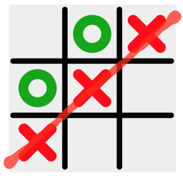
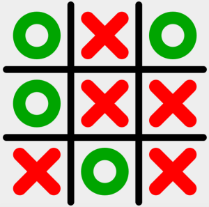
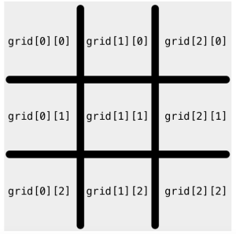

# Java_TicTacToe
Tic-Tac-Toe is a 2 player board game. One player is X and the other player is O. The game starts with an empty 3x3 grid with 9 cells. The players take turns marking each cell with either an X or an O. The goal for the X player is to get 3 X’s in one line either vertically, horizontally or diagonally. The goal for the O player is to get 3 O’s in one line either vertically, horizontally or diagonally.

---
* Once a line is formed the game ends and the player who formed that line wins!

* Sometimes there is no winner. This occurs when all of the cells are filled in but there is no line of 3 X's or 3 O's. This often happens, especially when both players are good. In this case, this game ends as a tie.

## Code design
The source code includes 2 main Java files, Game.java and GameUI.java.

Game.java is where all the game logic code exists.

GameUI.java is where all the user interface code exists. 

* Implement the checkGameWinner() function in the Game.java file.
* If I detect a winner, set the variable result to either “X wins” or “O wins” depending on the player who won.
* If the game ends as a tie, set result to “Tie.”
* If the game has not ended yet set result to “None.”
* doChecks() is a function that is responsible for calling checkGameWinner every time a player takes a turn

String checkGameWinner(char[][] grid) has a 2D char array as an input representing the game grid (see below for details) and it returns a String message indicating which player has won (X wins , O wins, Tie, or None if the game hasn't ended yet)

## What I have learned
* Get the program to run in IntelliJ as a Game interface
* Determine all the winning patterns in an array
* Arrange the logic to return a winning / a tie

